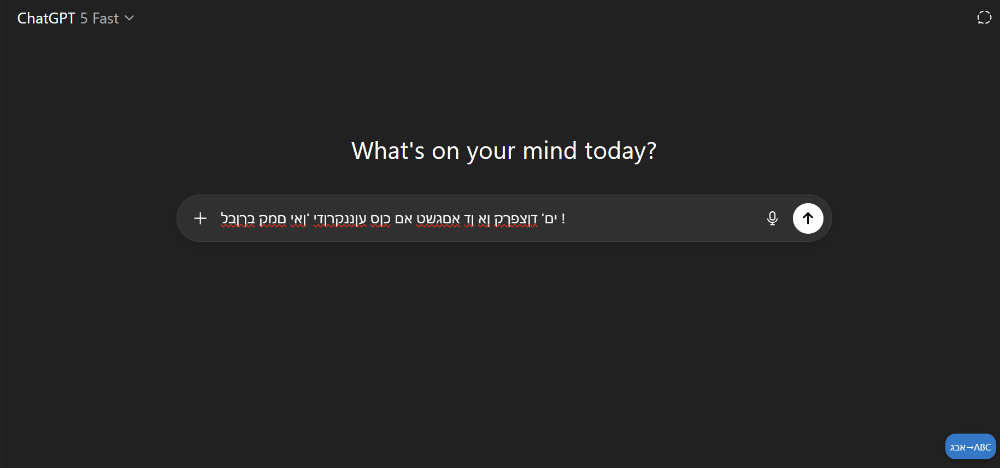
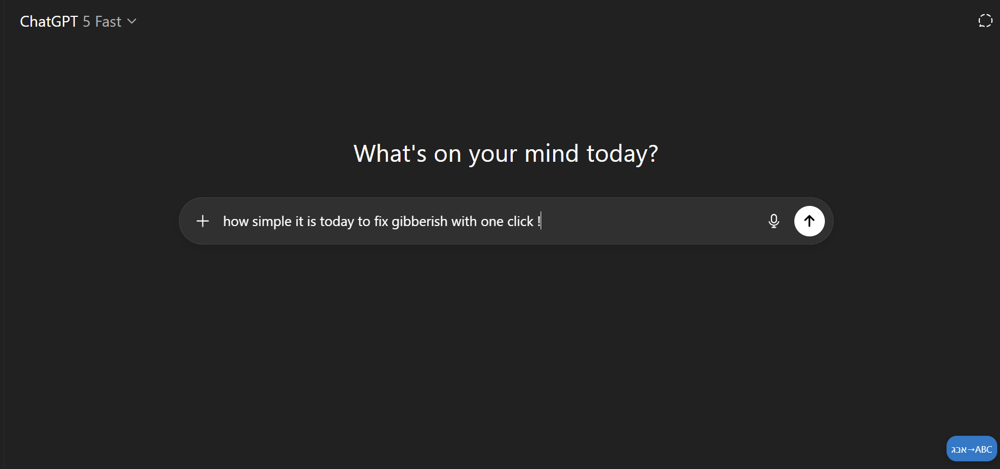
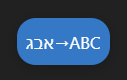

# UnGibberish (Chrome Extension, MV3)


Fix Hebrew↔English keyboard layout mistakes in ChatGPT’s textarea.

## Features
- Shortcut: Alt+Shift+F to fix the current input
- Context menu on editable fields: "UnGibberish: Fix layout"
- Popup button to trigger the fix in the active tab
- Overlay button inside the page (bottom-right) when an editable is detected

## Demo
Before:

ים' דןצפךק ןא ןד אםגשט אם כןס עןננקרןדי 'ןאי םמק בךןבל !




After pressing **UnGibberish**:

how simple it is today to fix gibberish with one click !




### The button




## Install (Developer Mode)
1. Icons are included in `assets/`.
2. Open Chrome → Extensions → Enable Developer mode.
3. Click "Load unpacked" and select the `UnGibberish` folder.
4. Visit `https://chat.openai.com` or `https://chatgpt.com`.

## Usage
- Place the cursor in ChatGPT’s message box, press Alt+Shift+F, or click the overlay button, or use the context menu.
- The extension will transform the selected text (if any) or the whole field using a Hebrew↔English mapping.

## Notes
- The mapping is heuristic and covers common printable characters from standard QWERTY↔Hebrew. It may not be perfect for all symbols.
- Works with `textarea` and `contenteditable` inputs.

## File Structure
```
UnGibberish/
├─ manifest.json
├─ pacage.json
├─ README.md
├─ assets/
│  ├─ icon16.png
│  ├─ icon32.png
│  ├─ icon48.png
│  └─ icon128.png
├─ background/
│  └─ service_worker.js
├─ src/
│  ├─ content.js
│  ├─ mapping.js
│  ├─ mapping.browser.js
│  └─ overlay.css
├─ ui/
│   ├─ popup.html
│   └─ popup.js
├─ tests/
│    └─ mapping.test.js
│
└─images/
    ├─ Before.png
    ├─ After.png
    └─ Button.png
```

